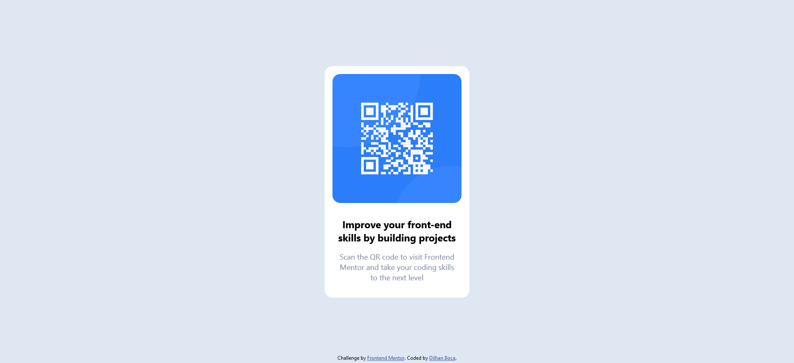

# Frontend Mentor - QR code component - Customized READ.ME Document

>## Please Note

      Note that this is the custom READ.ME document written by Dilhan Boca. This is NOT the original document, nor the template provided by Frontend Mentor. 


## Contents

- [Overview](#overview)
- [Screenshot](#screenshot)
- [Process](#Process)
- [Built with](#built-with)
- [What I learned](#what-i-learned)
- [Continued development](#continued-development)
- [Author](#author)


**Note: Delete this note and update the table of contents based on what sections you keep.**

## Overview

 This is my first Frontend Mentor Task. The aim here is to correctly position the QR Code Component, 
 so that it's positioned properly vertically and horizontally. I have made some stylistic amendments 
 on the feature itself when the screen size is @420px & below. 

 The link to the Frontend Mentor task is found here:

[QR code component challenge on Frontend Mentor](https://www.frontendmentor.io/challenges/qr-code-component-iux_sIO_H)

 ---

## Screenshot


**Desktop Screenshot**



**Mobile Screenshot**

Note: The mobile screenshot has been taken after media queries have adjusted styles after 420px screen width. 


--- 

## Process 

After adjusting for the styles recommended in the style guide, the core task of centering the pre-made
QR Code Component was done with a classic technique taken from the W3Schools Website.

The QR Code Component was wrapped in the:

```CSS
.main__container {}
```

After some other styles were added, the key code to center the component was added:

```CSS
.main__container {
  margin: 0;
  position: absolute;
  top: 50%;
  left: 50%;
  -ms-transform: translate(-50%, -50%);
  transform: translate(-50%, -50%);
}
```

Also note that the screenshots used were taken where then included into images folder. The repostitory
itself was uploaded using GIT BASH. Then placed onto GitHub Pages. 

## Built With 

Clearly the task was built with a mixture of HTML and CSS. 

## What I learned

I learned the classic technique of centering a div, however there are also other methods available, 
the most commonly used are involve the use of flexbox and grid, and are spoken about in this 
video here:

[How to center a DIV](https://www.youtube.com/shorts/njdJeu95p6s)

## Continued development

In the future I'd like to master all the techniques for centering divs, as all of these may be helpful in 
completing future projects. 

## Author

My name is Dilhan Boca, I'm based in Melbourne, Australia. I'd like to build up a portfolio, before 
applying for a position somewhere in web development at a web development firm. 

